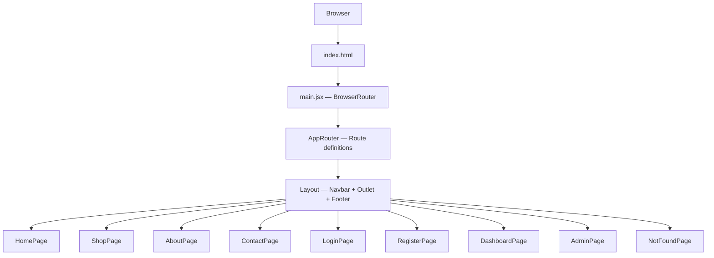

# Design Document: N A Pharma Project Setup

## Overview

This document describes the technical design for the initial project setup of **N A Pharma** — a professional pharmacy management web application. The goal of this phase is to establish a clean, scalable foundation: Vite + React scaffolding, a Tailwind CSS design system, a React Router DOM routing layer, a shared Layout component, and fully designed Navbar and Footer components. No business logic or data fetching is in scope; this phase delivers the structural skeleton that all future features will build upon.

### Technology Stack

| Layer | Technology |
|---|---|
| Build tool | Vite 5 (React template) |
| UI framework | React 18 |
| Routing | React Router DOM v6 |
| Styling | Tailwind CSS v3 (PostCSS plugin) |
| Animations | Framer Motion v11 |
| Icons | Lucide React |
| Language | JavaScript (JSX) |

---

## Architecture

The application follows a **client-side single-page application (SPA)** architecture. All routing is handled in the browser via React Router DOM. There is no server-side rendering in this phase.



### Key Architectural Decisions

1. **Centralized route definitions** — All routes live in `src/routes/index.jsx`. This makes it trivial to add, remove, or protect routes in one place.
2. **Layout as a route wrapper** — The `Layout` component is used as a parent route element in React Router v6, so `<Outlet />` renders the matched child page. This avoids duplicating Navbar/Footer in every page.
3. **Local UI state only** — Cart count, wishlist count, and mobile menu state are managed with `useState` / custom hooks in this phase. No global state library (Redux, Zustand) is introduced yet; the hooks are designed to be easily replaced later.
4. **Tailwind utility-first** — No CSS modules or styled-components. All styling is done via Tailwind utility classes, with the design system tokens defined in `tailwind.config.js`.
5. **Framer Motion for page transitions** — `AnimatePresence` wraps the `<Outlet />` in Layout, providing smooth fade/slide transitions between pages without per-page boilerplate.

---

## Components and Interfaces

### Component Hierarchy

```
App (main.jsx)
└── BrowserRouter
    └── AppRouter (src/routes/index.jsx)
        └── Route path="/" element={<Layout />}
            ├── Route index element={<HomePage />}
            ├── Route path="shop" element={<ShopPage />}
            ├── Route path="about" element={<AboutPage />}
            ├── Route path="contact" element={<ContactPage />}
            ├── Route path="login" element={<LoginPage />}
            ├── Route path="register" element={<RegisterPage />}
            ├── Route path="dashboard" element={<DashboardPage />}
            ├── Route path="admin" element={<AdminPage />}
            └── Route path="*" element={<NotFoundPage />}
```

### File / Folder Structure

```
na-pharma/
├── index.html
├── vite.config.js
├── tailwind.config.js
├── postcss.config.js
├── package.json
└── src/
    ├── main.jsx                    # Entry point — mounts BrowserRouter + AppRouter
    ├── App.jsx                     # (thin wrapper, or merged into main.jsx)
    ├── assets/
    │   └── logo.svg                # Brand mark SVG
    ├── styles/
    │   └── index.css               # Tailwind directives + global base styles
    ├── routes/
    │   └── index.jsx               # Centralized route definitions
    ├── layouts/
    │   └── Layout.jsx              # Navbar + AnimatePresence Outlet + Footer
    ├── components/
    │   ├── ui/
    │   │   ├── Button.jsx          # Multi-variant button component
    │   │   ├── Input.jsx           # Accessible form input with label/error
    │   │   ├── Modal.jsx           # Animated modal dialog with focus trap
    │   │   ├── LoadingSkeleton.jsx # Shimmer placeholder for loading states
    │   │   ├── SectionContainer.jsx # Max-width layout wrapper
    │   │   └── DashboardCard.jsx   # Metric card for dashboard views
    │   ├── shop/
    │   │   └── MedicineCard.jsx    # Product card for shop listings
    │   ├── admin/
    │   │   └── DataTable.jsx       # Sortable, accessible data table
    │   ├── navbar/
    │   │   ├── Navbar.jsx          # Root navbar component
    │   │   ├── NavLinks.jsx        # Desktop navigation links
    │   │   ├── NavActions.jsx      # Cart, Wishlist, Login/Register buttons
    │   │   ├── MobileDrawer.jsx    # Slide-in mobile menu drawer
    │   │   └── HamburgerButton.jsx # Animated hamburger/close toggle
    │   └── footer/
    │       ├── Footer.jsx          # Root footer component
    │       ├── FooterBrand.jsx     # Logo + tagline + description
    │       ├── FooterLinks.jsx     # Quick Links / Services columns
    │       ├── FooterContact.jsx   # Address, phone, email
    │       ├── FooterSocial.jsx    # Social media icon links
    │       └── FooterNewsletter.jsx # Email input + subscribe button
    ├── pages/
    │   ├── HomePage.jsx
    │   ├── ShopPage.jsx
    │   ├── AboutPage.jsx
    │   ├── ContactPage.jsx
    │   ├── LoginPage.jsx
    │   ├── RegisterPage.jsx
    │   ├── DashboardPage.jsx
    │   ├── AdminPage.jsx
    │   └── NotFoundPage.jsx
    ├── hooks/
    │   ├── useScrolled.js          # Returns boolean: has user scrolled > threshold?
    │   ├── useMobileMenu.js        # Returns { isOpen, toggle, close }
    │   ├── useCartCount.js         # Returns cart item count (stub for now)
    │   └── useWishlistCount.js     # Returns wishlist item count (stub for now)
    └── utils/
        └── cn.js                   # Tailwind class merging utility (clsx + twMerge)
```

### Component Interface Specifications

#### `Layout.jsx`

```jsx
// No props — reads route context internally via useLocation
export default function Layout()
```

Responsibilities:
- Renders `<Navbar />` at the top
- Wraps `<Outlet />` in `<AnimatePresence mode="wait">` for page transitions
- Renders `<Footer />` at the bottom
- Applies `min-h-screen flex flex-col` so footer is always pushed to the bottom

#### `Navbar.jsx`

```jsx
// No external props — all state is internal
export default function Navbar()
```

Internal state (via hooks):
- `isScrolled: boolean` — from `useScrolled(20)` (threshold: 20px)
- `isMenuOpen: boolean` — from `useMobileMenu()`
- `cartCount: number` — from `useCartCount()`
- `wishlistCount: number` — from `useWishlistCount()`

#### `NavLinks.jsx`

```jsx
interface NavLink {
  label: string;   // e.g. "Home"
  to: string;      // e.g. "/"
}

// Props
{ links: NavLink[], onLinkClick?: () => void }
```

Uses `<NavLink>` from React Router to get `isActive` for styling.

#### `NavActions.jsx`

```jsx
// Props
{ cartCount: number, wishlistCount: number, onLinkClick?: () => void }
```

Renders: Cart icon + badge, Wishlist icon + badge, Login button, Register button.

#### `MobileDrawer.jsx`

```jsx
// Props
{ isOpen: boolean, onClose: () => void, cartCount: number, wishlistCount: number }
```

Animated with Framer Motion `motion.div` sliding in from the right (or top). Renders `NavLinks` and `NavActions` inside.

#### `HamburgerButton.jsx`

```jsx
// Props
{ isOpen: boolean, onClick: () => void }
```

Animates between hamburger (☰) and close (✕) icons using Framer Motion.

#### `Footer.jsx`

```jsx
// No props
export default function Footer()
```

Composes all footer sub-components in a responsive grid.

#### `FooterNewsletter.jsx`

```jsx
// Local state: email string, subscribed boolean
export default function FooterNewsletter()
```

#### Placeholder Page Components

All placeholder pages share the same shape:

```jsx
// Props: none
// Renders: page title + "under construction" message
export default function [Name]Page()
```

---

## Data Models

### Navigation Link Definition

```js
// src/routes/index.jsx
const NAV_LINKS = [
  { label: 'Home',    to: '/' },
  { label: 'Shop',    to: '/shop' },
  { label: 'About',  to: '/about' },
  { label: 'Contact', to: '/contact' },
];
```

### Route Definition

```js
// src/routes/index.jsx
const ROUTES = [
  { path: '/',          element: <HomePage /> },
  { path: '/shop',      element: <ShopPage /> },
  { path: '/about',     element: <AboutPage /> },
  { path: '/contact',   element: <ContactPage /> },
  { path: '/login',     element: <LoginPage /> },
  { path: '/register',  element: <RegisterPage /> },
  { path: '/dashboard', element: <DashboardPage /> },
  { path: '/admin',     element: <AdminPage /> },
  { path: '*',          element: <NotFoundPage /> },
];
```

### Scroll State

```js
// useScrolled.js
// Returns: boolean
// true  → user has scrolled past `threshold` pixels
// false → user is at or near the top
```

### Mobile Menu State

```js
// useMobileMenu.js
// Returns: { isOpen: boolean, toggle: () => void, close: () => void }
```

### Cart / Wishlist Count (Stub)

```js
// useCartCount.js / useWishlistCount.js
// Returns: number (hardcoded to 0 in this phase)
// Designed to be replaced with context/store reads in a future phase
```

### Design System Tokens (Tailwind Config)

```js
// tailwind.config.js — theme.extend
{
  colors: {
    primary: {
      50:  '#f0fdf4',
      100: '#dcfce7',
      200: '#bbf7d0',
      300: '#86efac',
      400: '#4ade80',
      500: '#22c55e',
      600: '#16a34a',   // primary brand green
      700: '#15803d',
      800: '#166534',
      900: '#14532d',
    },
    secondary: {
      50:  '#eff6ff',
      100: '#dbeafe',
      200: '#bfdbfe',
      300: '#93c5fd',
      400: '#60a5fa',
      500: '#3b82f6',
      600: '#2563eb',   // secondary brand blue
      700: '#1d4ed8',
      800: '#1e40af',
      900: '#1e3a8a',
    },
    neutral: {
      50:  '#f9fafb',
      100: '#f3f4f6',
      200: '#e5e7eb',
      300: '#d1d5db',
      400: '#9ca3af',
      500: '#6b7280',
      600: '#4b5563',
      700: '#374151',
      800: '#1f2937',
      900: '#111827',
    },
  },
  fontFamily: {
    sans: ['Inter', 'system-ui', 'sans-serif'],
  },
  borderRadius: {
    'xl':  '0.75rem',
    '2xl': '1rem',
    '3xl': '1.5rem',
  },
  boxShadow: {
    'soft':    '0 2px 15px -3px rgba(0,0,0,0.07), 0 10px 20px -2px rgba(0,0,0,0.04)',
    'soft-lg': '0 4px 25px -5px rgba(0,0,0,0.10), 0 10px 30px -5px rgba(0,0,0,0.05)',
  },
}
```

---

## Correctness Properties

*A property is a characteristic or behavior that should hold true across all valid executions of a system — essentially, a formal statement about what the system should do. Properties serve as the bridge between human-readable specifications and machine-verifiable correctness guarantees.*

### Property Reflection

Before writing properties, I reviewed all prework classifications:

- Requirements 1.x, 2.x, 3.x — all SMOKE (configuration/setup checks). No PBT value.
- Requirements 4.1–4.8 — EXAMPLE (specific route checks). Fixed set of known paths.
- Requirement 4.9 — PROPERTY: for any unknown path, render 404.
- Requirement 4.10 — PROPERTY: for any defined route, Layout (Navbar + Footer) is present.
- Requirements 5.1, 5.2 — EXAMPLE, but subsumed by 4.10 (same assertion). Redundant — drop.
- Requirements 5.3, 5.4, 5.5 — EXAMPLE (structural/animation checks).
- Requirements 6.1–6.3, 6.5, 6.7, 6.8 — EXAMPLE (specific rendering checks).
- Requirement 6.4 — PROPERTY: for any defined route, the matching nav link is styled active.
- Requirement 6.6 — PROPERTY: hamburger toggle is a round-trip (click twice = original state).
- Requirements 7.1–7.3, 7.5, 7.6 — EXAMPLE (specific rendering checks).
- Requirement 7.4 — PROPERTY: footer copyright year is dynamically the current year.
- Requirements 8.1, 8.3, 8.4 — EXAMPLE (existence/rendering checks).
- Requirement 8.2 — PROPERTY: for any placeholder page, it displays its page name.

**Redundancy check:**
- Property from 4.10 (Layout wraps all routes) and properties from 5.1/5.2 (Navbar/Footer present) are logically equivalent — keep only the 4.10 formulation.
- Property from 6.4 (active link styling) is independent of all others — keep.
- Property from 6.6 (hamburger toggle round-trip) is independent — keep.
- Property from 7.4 (copyright year) is independent — keep.
- Property from 8.2 (placeholder pages display name) is independent — keep.

Final set: 5 properties.

---

### Property 1: Layout wraps every defined route

*For any* defined route path in the application, rendering the router at that path should produce output that includes both the Navbar and the Footer components.

**Validates: Requirements 4.10, 5.1, 5.2**

---

### Property 2: Unknown paths always render the 404 page

*For any* path string that does not match a defined application route, the router should render the NotFound (404) page component and not any other page component.

**Validates: Requirements 4.9**

---

### Property 3: Active navigation link reflects current route

*For any* navigation link path (Home `/`, Shop `/shop`, About `/about`, Contact `/contact`), when the router is at that path, the corresponding `<NavLink>` element should have the active CSS class applied, and no other navigation link should have the active class.

**Validates: Requirements 6.4**

---

### Property 4: Mobile menu toggle is a round-trip

*For any* initial open/closed state of the mobile navigation drawer, toggling the hamburger button twice (open then close, or close then open) should return the drawer to its original state.

**Validates: Requirements 6.6**

---

### Property 5: Footer copyright year is always current

*For any* year value, when the Footer component is rendered with the system clock set to that year, the rendered copyright text should contain that exact year.

**Validates: Requirements 7.4**

---

## Error Handling

### Routing Errors

- **Unknown route** — The `path="*"` catch-all route renders `<NotFoundPage />`, which displays a friendly message and a link back to `/`.
- **No route match within Layout** — React Router v6 renders nothing in the `<Outlet />` if no child route matches; the `*` wildcard prevents this from occurring silently.

### Navbar State Errors

- **Scroll listener cleanup** — `useScrolled` attaches a `scroll` event listener in a `useEffect` and removes it on cleanup to prevent memory leaks.
- **Mobile menu body scroll lock** — When `isMenuOpen` is true, `document.body.style.overflow = 'hidden'` is set to prevent background scrolling; it is restored on close or unmount.

### Footer Newsletter

- **Empty email submission** — The subscribe button is disabled when the email input is empty. Basic HTML5 `type="email"` validation is applied.
- **Duplicate subscription** — After a successful submission (stub in this phase), the form is replaced with a confirmation message and the input is disabled.

### Animation Errors

- **Framer Motion `AnimatePresence`** — Requires a unique `key` prop on the animated child. The `useLocation().pathname` is used as the key so React correctly unmounts/mounts on route change.

---

## Testing Strategy

### Overview

This feature is primarily structural (scaffolding, configuration, component wiring). The testing strategy uses:

1. **Smoke tests** — Verify project structure, dependency presence, and build success.
2. **Example-based unit tests** — Verify specific component rendering (Navbar content, Footer content, page components).
3. **Property-based tests** — Verify universal behaviors using [fast-check](https://github.com/dubzzz/fast-check) (JavaScript PBT library), minimum 100 iterations per property.

### Test Framework Setup

- **Test runner**: Vitest
- **Component testing**: React Testing Library (`@testing-library/react`)
- **PBT library**: `fast-check`
- **DOM environment**: `jsdom` (via Vitest config)

### Smoke Tests (`src/__tests__/smoke/`)

| Test | Verifies |
|---|---|
| `project-structure.test.js` | All required directories exist (Req 2.1–2.8) |
| `dependencies.test.js` | All required packages in package.json (Req 1.2–1.5) |
| `tailwind-config.test.js` | Color scales, font, spacing tokens defined (Req 3.1–3.5) |
| `build.test.js` | `vite build` exits with code 0 (Req 1.6) |

### Example-Based Unit Tests (`src/__tests__/unit/`)

| Test file | Component | Verifies |
|---|---|---|
| `Navbar.test.jsx` | Navbar | Brand name, nav links, Login/Register buttons, scroll shadow class, mobile hamburger visibility |
| `MobileDrawer.test.jsx` | MobileDrawer | Drawer renders links when open, hidden when closed |
| `Footer.test.jsx` | Footer | Brand name, tagline, link sections, social icons, newsletter form |
| `Layout.test.jsx` | Layout | Navbar present, Footer present, Outlet renders child |
| `pages.test.jsx` | All page stubs | Each page renders without throwing, displays page name |
| `NotFoundPage.test.jsx` | NotFoundPage | Error message present, home link present |
| `AppRouter.test.jsx` | AppRouter | Each defined route renders the correct page component |

### Property-Based Tests (`src/__tests__/properties/`)

Each property test uses `fast-check` and runs a minimum of 100 iterations.

#### Property 1: Layout wraps every defined route

```js
// Feature: na-pharma-project-setup, Property 1: Layout wraps every defined route
fc.assert(
  fc.property(fc.constantFrom(...DEFINED_PATHS), (path) => {
    const { getByTestId } = render(<MemoryRouter initialEntries={[path]}><AppRouter /></MemoryRouter>);
    expect(getByTestId('navbar')).toBeInTheDocument();
    expect(getByTestId('footer')).toBeInTheDocument();
  }),
  { numRuns: 100 }
);
```

#### Property 2: Unknown paths always render the 404 page

```js
// Feature: na-pharma-project-setup, Property 2: Unknown paths always render the 404 page
fc.assert(
  fc.property(
    fc.string({ minLength: 1 }).filter(s => !DEFINED_PATHS.includes('/' + s)),
    (randomSegment) => {
      const { getByTestId } = render(
        <MemoryRouter initialEntries={['/' + randomSegment]}><AppRouter /></MemoryRouter>
      );
      expect(getByTestId('not-found-page')).toBeInTheDocument();
    }
  ),
  { numRuns: 100 }
);
```

#### Property 3: Active navigation link reflects current route

```js
// Feature: na-pharma-project-setup, Property 3: Active navigation link reflects current route
fc.assert(
  fc.property(fc.constantFrom(...NAV_LINK_PATHS), (activePath) => {
    const { getAllByRole } = render(
      <MemoryRouter initialEntries={[activePath]}><Navbar /></MemoryRouter>
    );
    const activeLinks = getAllByRole('link').filter(l =>
      l.classList.contains('nav-link-active')
    );
    expect(activeLinks).toHaveLength(1);
    expect(activeLinks[0]).toHaveAttribute('href', activePath);
  }),
  { numRuns: 100 }
);
```

#### Property 4: Mobile menu toggle is a round-trip

```js
// Feature: na-pharma-project-setup, Property 4: Mobile menu toggle is a round-trip
fc.assert(
  fc.property(fc.boolean(), (initiallyOpen) => {
    const { result } = renderHook(() => useMobileMenu(initiallyOpen));
    const originalState = result.current.isOpen;
    act(() => result.current.toggle());
    act(() => result.current.toggle());
    expect(result.current.isOpen).toBe(originalState);
  }),
  { numRuns: 100 }
);
```

#### Property 5: Footer copyright year is always current

```js
// Feature: na-pharma-project-setup, Property 5: Footer copyright year is always current
fc.assert(
  fc.property(fc.integer({ min: 2000, max: 2100 }), (year) => {
    jest.spyOn(global, 'Date').mockImplementation(() => ({ getFullYear: () => year }));
    const { getByTestId } = render(<Footer />);
    expect(getByTestId('footer-copyright').textContent).toContain(String(year));
    jest.restoreAllMocks();
  }),
  { numRuns: 100 }
);
```

### Test Coverage Targets

| Category | Target |
|---|---|
| Component rendering | 100% of defined components render without errors |
| Route coverage | 100% of defined routes tested |
| Property coverage | All 5 properties have passing PBT tests |
| Smoke coverage | All 8 structural requirements verified |

---

## Animation Strategy (Framer Motion)

### Page Transitions

`AnimatePresence` in `Layout.jsx` wraps the `<Outlet />`. Each page transition uses a fade + slight upward slide:

```jsx
// Layout.jsx
const pageVariants = {
  initial: { opacity: 0, y: 12 },
  animate: { opacity: 1, y: 0, transition: { duration: 0.25, ease: 'easeOut' } },
  exit:    { opacity: 0, y: -8, transition: { duration: 0.15, ease: 'easeIn' } },
};

<AnimatePresence mode="wait">
  <motion.div key={location.pathname} variants={pageVariants}
    initial="initial" animate="animate" exit="exit">
    <Outlet />
  </motion.div>
</AnimatePresence>
```

### Navbar Animations

| Element | Animation |
|---|---|
| Nav links (hover) | `whileHover={{ y: -1 }}` + color transition via Tailwind `transition-colors` |
| Cart/Wishlist icons (hover) | `whileHover={{ scale: 1.1 }}` |
| Login/Register buttons (hover) | `whileHover={{ scale: 1.02 }}` + shadow deepening |
| Scroll shadow | CSS `transition-shadow duration-300` driven by `isScrolled` state |
| Badge count change | `AnimatePresence` + scale pop when count changes |

### Mobile Drawer Animation

```jsx
// MobileDrawer.jsx
const drawerVariants = {
  closed: { x: '100%', opacity: 0 },
  open:   { x: 0,      opacity: 1, transition: { type: 'spring', stiffness: 300, damping: 30 } },
};
```

A semi-transparent backdrop fades in behind the drawer (`opacity: 0 → 0.5`).

### Hamburger Button Animation

The hamburger icon morphs to a close icon using Framer Motion `animate` on the three bar elements (top bar rotates +45°, middle bar fades out, bottom bar rotates −45°).

### Footer Animations

Footer sections use `whileInView` with `viewport={{ once: true }}` for a one-time entrance animation as the user scrolls down:

```jsx
<motion.div
  initial={{ opacity: 0, y: 20 }}
  whileInView={{ opacity: 1, y: 0 }}
  viewport={{ once: true }}
  transition={{ duration: 0.4, delay: index * 0.1 }}
>
```

---

## Responsive Breakpoint Strategy

Tailwind's default breakpoints are used:

| Breakpoint | Min-width | Usage |
|---|---|---|
| `sm` | 640px | Minor spacing adjustments |
| `md` | 768px | Navbar: show desktop links, hide hamburger |
| `lg` | 1024px | Footer: 4-column grid |
| `xl` | 1280px | Max content width container |

### Navbar Responsive Behavior

```
< 768px  (mobile):  Logo | [spacer] | Cart icon | Wishlist icon | Hamburger
≥ 768px  (tablet):  Logo | Nav links | [spacer] | Cart | Wishlist | Login | Register
≥ 1024px (desktop): Same as tablet, wider container
```

The mobile drawer slides in from the right and covers the full viewport height. It contains all nav links and action buttons stacked vertically.

### Footer Responsive Behavior

```
< 768px  (mobile):  Single column — Brand → Quick Links → Services → Contact → Social → Newsletter
≥ 768px  (tablet):  2-column grid
≥ 1024px (desktop): 4-column grid — Brand | Quick Links | Services | Contact+Social+Newsletter
```

### Layout Container

A shared `max-w-7xl mx-auto px-4 sm:px-6 lg:px-8` container class is used consistently across Navbar, Footer, and page content areas.

---

## Reusable Component System

This section defines the shared UI component library located in `src/components/ui/` and the domain-specific components in `src/components/shop/` and `src/components/admin/`. All components are built with Tailwind CSS utility classes and follow the design system tokens defined in `tailwind.config.js`.

### Design Conventions

- **All pages** use `SectionContainer` for consistent max-width and padding.
- **Spacing scale**: section padding `py-16 lg:py-24`, card gaps `gap-6`, form gaps `gap-4`.
- **Visual hierarchy**: H1 `text-4xl font-bold`, H2 `text-3xl font-semibold`, H3 `text-xl font-semibold`, body `text-base`.
- **Subtle gradients**: hero sections use `bg-gradient-to-br from-primary-50 to-secondary-50`.
- **Glass effects**: dashboard cards use `bg-white/80 backdrop-blur-sm border border-white/20`.
- **Accessibility**: minimum 4.5:1 contrast ratio for all text; focus rings on all interactive elements (`focus:ring-2 focus:ring-primary-500 focus:ring-offset-2`).
- **Mobile nav UX**: drawer has swipe-to-close gesture hint; links have `py-3` tap targets (minimum 44px); close button in top-right of drawer.

---

### `Button` (`src/components/ui/Button.jsx`)

A polymorphic button component supporting multiple visual variants and sizes.

#### Props

| Prop | Type | Default | Description |
|---|---|---|---|
| `variant` | `'primary' \| 'secondary' \| 'outline' \| 'ghost' \| 'danger'` | `'primary'` | Visual style variant |
| `size` | `'sm' \| 'md' \| 'lg'` | `'md'` | Size preset |
| `isLoading` | `boolean` | `false` | Shows spinner, disables interaction |
| `leftIcon` | `ReactNode` | — | Icon rendered before children |
| `rightIcon` | `ReactNode` | — | Icon rendered after children |
| `children` | `ReactNode` | — | Button label content |
| `...rest` | `ButtonHTMLAttributes` | — | Forwarded to `<button>` element |

#### Variant Styles

| Variant | Classes |
|---|---|
| `primary` | `bg-primary-600 text-white hover:bg-primary-700` |
| `secondary` | `bg-secondary-600 text-white hover:bg-secondary-700` |
| `outline` | `border border-primary-600 text-primary-600 hover:bg-primary-50` |
| `ghost` | `text-primary-600 hover:bg-primary-50` |
| `danger` | `bg-red-600 text-white hover:bg-red-700` |

#### Size Styles

| Size | Classes |
|---|---|
| `sm` | `px-3 py-1.5 text-sm rounded-lg` |
| `md` | `px-4 py-2 text-base rounded-xl` |
| `lg` | `px-6 py-3 text-lg rounded-xl` |

Loading state renders a `<Loader2 className="animate-spin" />` icon from Lucide React and sets `disabled` on the underlying `<button>`.

---

### `Input` (`src/components/ui/Input.jsx`)

A form input component with label, helper text, error state, and optional icon slots.

#### Props

| Prop | Type | Description |
|---|---|---|
| `label` | `string` | Visible label text; linked via `htmlFor` |
| `error` | `string` | Error message; triggers red border + error text |
| `helperText` | `string` | Subtle hint text below the input |
| `leftIcon` | `ReactNode` | Icon rendered inside the left edge of the input |
| `rightIcon` | `ReactNode` | Icon rendered inside the right edge of the input |
| `...rest` | `InputHTMLAttributes` | Forwarded to `<input>` element |

#### Accessibility

- `<label>` is linked to `<input>` via matching `htmlFor` / `id` (derived from `label` prop).
- Error message container has `id="{inputId}-error"` and the `<input>` has `aria-describedby="{inputId}-error"` when an error is present.
- Error state applies `aria-invalid="true"` to the `<input>`.

#### Visual States

| State | Border | Text |
|---|---|---|
| Default | `border-neutral-300` | `text-neutral-900` |
| Focus | `border-primary-500 ring-2 ring-primary-500 ring-offset-2` | — |
| Error | `border-red-500` | Error text `text-red-600 text-sm` |
| Disabled | `border-neutral-200 bg-neutral-50 cursor-not-allowed` | `text-neutral-400` |

---

### `Modal` (`src/components/ui/Modal.jsx`)

An accessible modal dialog with Framer Motion entrance animation.

#### Props

| Prop | Type | Default | Description |
|---|---|---|---|
| `isOpen` | `boolean` | — | Controls visibility |
| `onClose` | `() => void` | — | Called on backdrop click or Escape key |
| `title` | `string` | — | Modal heading |
| `children` | `ReactNode` | — | Modal body content |
| `size` | `'sm' \| 'md' \| 'lg' \| 'xl'` | `'md'` | Controls max-width |

#### Size Widths

| Size | Max-width |
|---|---|
| `sm` | `max-w-sm` |
| `md` | `max-w-md` |
| `lg` | `max-w-lg` |
| `xl` | `max-w-xl` |

#### Behavior

- **Backdrop click**: calls `onClose`.
- **Escape key**: `useEffect` attaches a `keydown` listener; calls `onClose` on `Escape`.
- **Focus trap**: uses a `useEffect` to query all focusable elements inside the modal and cycles focus with `Tab` / `Shift+Tab`.
- **Body scroll lock**: sets `document.body.style.overflow = 'hidden'` when open; restores on close/unmount.

#### Animation

```jsx
// Backdrop
const backdropVariants = {
  hidden: { opacity: 0 },
  visible: { opacity: 1 },
};

// Panel
const panelVariants = {
  hidden: { opacity: 0, scale: 0.95, y: 10 },
  visible: { opacity: 1, scale: 1, y: 0, transition: { type: 'spring', stiffness: 300, damping: 25 } },
};
```

Rendered inside `<AnimatePresence>` so the exit animation plays when `isOpen` becomes `false`.

---

### `LoadingSkeleton` (`src/components/ui/LoadingSkeleton.jsx`)

A placeholder shimmer component for loading states.

#### Props

| Prop | Type | Default | Description |
|---|---|---|---|
| `variant` | `'text' \| 'card' \| 'avatar' \| 'table-row'` | `'text'` | Shape preset |
| `count` | `number` | `1` | Number of skeleton items to render |
| `className` | `string` | — | Additional Tailwind classes |

#### Variant Shapes

| Variant | Shape |
|---|---|
| `text` | Full-width rounded bar, `h-4` |
| `card` | Rounded rectangle, `h-48 w-full rounded-2xl` |
| `avatar` | Circle, `h-10 w-10 rounded-full` |
| `table-row` | Full-width bar, `h-12 rounded-lg` |

All variants use `bg-neutral-200 animate-pulse` for the shimmer effect. When `count > 1`, renders `count` items with `gap-3` spacing.

---

### `SectionContainer` (`src/components/ui/SectionContainer.jsx`)

A layout wrapper that enforces consistent max-width, horizontal padding, and optional vertical spacing.

#### Props

| Prop | Type | Default | Description |
|---|---|---|---|
| `as` | `ElementType` | `'section'` | Semantic HTML element (`section`, `div`, `main`, `article`) |
| `py` | `'sm' \| 'md' \| 'lg' \| 'xl'` | `'md'` | Vertical padding preset |
| `className` | `string` | — | Additional Tailwind classes |
| `children` | `ReactNode` | — | Section content |

#### Padding Scale

| `py` value | Classes |
|---|---|
| `sm` | `py-8` |
| `md` | `py-12` |
| `lg` | `py-16 lg:py-24` |
| `xl` | `py-24 lg:py-32` |

Container always applies `max-w-7xl mx-auto px-4 sm:px-6 lg:px-8`.

---

### `DashboardCard` (`src/components/ui/DashboardCard.jsx`)

A metric card for dashboard overview sections.

#### Props

| Prop | Type | Description |
|---|---|---|
| `title` | `string` | Metric label (e.g., "Total Orders") |
| `value` | `string \| number` | Primary metric value |
| `icon` | `ReactNode` | Lucide icon element |
| `trend` | `'up' \| 'down' \| 'neutral'` | Trend direction |
| `trendValue` | `string` | Trend label (e.g., "+12%") |
| `color` | `'primary' \| 'secondary' \| 'success' \| 'warning'` | Accent color |

#### Visual Design

- Background: subtle gradient using the `color` prop (e.g., `bg-gradient-to-br from-primary-50 to-primary-100`).
- Glass variant: `bg-white/80 backdrop-blur-sm border border-white/20 shadow-soft`.
- Trend indicator: green arrow + text for `up`, red for `down`, gray for `neutral`.
- Hover animation: `whileHover={{ y: -2 }}` via Framer Motion `motion.div`.

---

### `MedicineCard` (`src/components/shop/MedicineCard.jsx`)

A product card for the shop page medicine listings.

#### Props

| Prop | Type | Description |
|---|---|---|
| `name` | `string` | Medicine name |
| `brand` | `string` | Brand/manufacturer |
| `price` | `number` | Current price |
| `originalPrice` | `number` | Original price (for discount badge) |
| `image` | `string` | Image URL |
| `category` | `string` | Medicine category |
| `inStock` | `boolean` | Stock availability |
| `rating` | `number` | Star rating (0–5) |
| `onAddToCart` | `() => void` | Add to cart callback |
| `onAddToWishlist` | `() => void` | Add to wishlist callback |

#### Visual Features

- **Discount badge**: rendered when `originalPrice > price`; shows percentage off using `bg-red-500 text-white text-xs rounded-full px-2 py-0.5`.
- **Out of stock overlay**: semi-transparent `bg-neutral-900/50` overlay with "Out of Stock" text when `inStock === false`.
- **Wishlist toggle**: heart icon (`Heart` from Lucide) with fill animation; toggles between filled and outline on click.
- **Add to cart button**: uses the `Button` component with `variant="primary"` and `size="sm"`; disabled when `inStock === false`.

---

### `DataTable` (`src/components/admin/DataTable.jsx`)

A sortable, accessible data table for admin views.

#### Props

| Prop | Type | Description |
|---|---|---|
| `columns` | `Array<{ key: string, label: string, render?: (value, row) => ReactNode }>` | Column definitions |
| `data` | `Array<object>` | Row data |
| `isLoading` | `boolean` | Shows `LoadingSkeleton` rows when true |
| `emptyMessage` | `string` | Message shown when `data` is empty |

#### Behavior

- **Sortable columns**: clicking a column header toggles sort direction (`asc` → `desc` → none). Sort state is `{ key: string | null, direction: 'asc' | 'desc' }`.
- **Loading state**: renders 5 `LoadingSkeleton` rows with `variant="table-row"` when `isLoading` is true.
- **Empty state**: renders `emptyMessage` centered in the table body when `data.length === 0` and `isLoading` is false.
- **Responsive**: wrapped in `overflow-x-auto` for horizontal scroll on mobile.

#### Accessibility

- Root element: `<table role="table">`.
- Header cells: `<th scope="col">` with sort button inside.
- Sort button `aria-label`: `"Sort by {label} ascending"` / `"Sort by {label} descending"`.
- Active sort column header: `aria-sort="ascending"` or `aria-sort="descending"`.

---

## Detailed Component Designs

### Navbar Visual Structure

```
┌─────────────────────────────────────────────────────────────────────┐
│  [🌿 Logo] N A Pharma    Home  Shop  About  Contact    🛒2  ❤️1  [Login] [Register] │
└─────────────────────────────────────────────────────────────────────┘
```

- **Background**: `bg-white` → `bg-white shadow-soft` on scroll
- **Height**: `h-16` (64px)
- **Position**: `fixed top-0 left-0 right-0 z-50`
- **Logo**: Green SVG mark + "N A Pharma" in `font-semibold text-neutral-800`
- **Nav links**: `text-neutral-600 hover:text-primary-600 transition-colors font-medium`
- **Active link**: `text-primary-600 font-semibold` + bottom border `border-b-2 border-primary-600`
- **Cart/Wishlist icons**: `text-neutral-600 hover:text-primary-600` with green badge `bg-primary-600 text-white text-xs rounded-full`
- **Login button**: `border border-primary-600 text-primary-600 hover:bg-primary-50 rounded-xl px-4 py-2`
- **Register button**: `bg-primary-600 text-white hover:bg-primary-700 rounded-xl px-4 py-2`

### Footer Visual Structure

```
┌─────────────────────────────────────────────────────────────────────┐
│  [Logo] N A Pharma          Quick Links    Services    Contact       │
│  Your trusted pharmacy      Home           Prescriptions  📍 Address │
│  partner for quality        Shop           Consultations  📞 Phone   │
│  healthcare products.       About          Delivery       ✉️ Email   │
│                             Contact        Returns                   │
│  [FB] [TW] [IG] [LI]                                                │
│                             Newsletter: [email input] [Subscribe]    │
├─────────────────────────────────────────────────────────────────────┤
│  © 2025 N A Pharma. All rights reserved.                            │
└─────────────────────────────────────────────────────────────────────┘
```

- **Background**: `bg-neutral-900` (dark footer)
- **Text**: `text-neutral-300` for body, `text-white` for headings
- **Section headings**: `text-white font-semibold text-sm uppercase tracking-wider`
- **Links**: `text-neutral-400 hover:text-primary-400 transition-colors text-sm`
- **Social icons**: `text-neutral-400 hover:text-primary-400` with `whileHover={{ scale: 1.2 }}`
- **Newsletter input**: `bg-neutral-800 border border-neutral-700 text-white rounded-xl px-4 py-2`
- **Subscribe button**: `bg-primary-600 hover:bg-primary-700 text-white rounded-xl px-4 py-2`
- **Divider**: `border-t border-neutral-800` above copyright row
